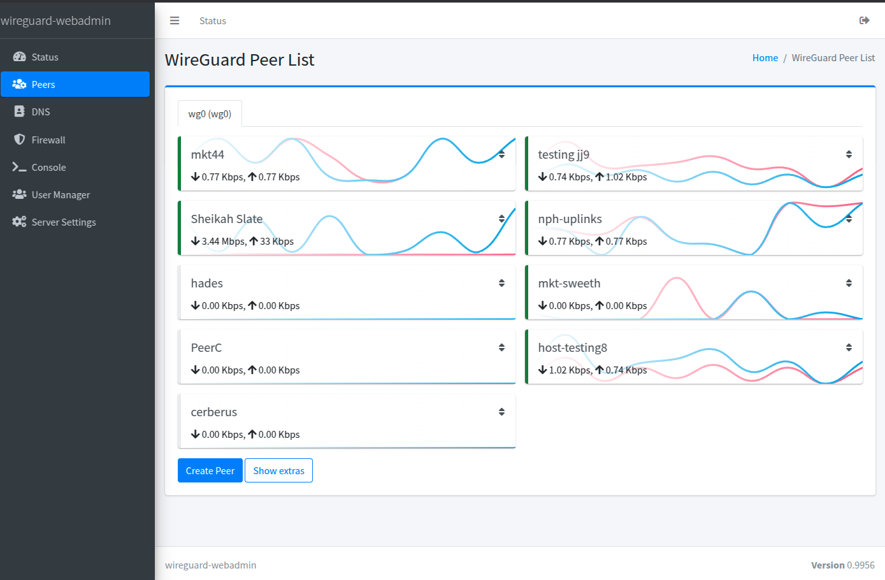
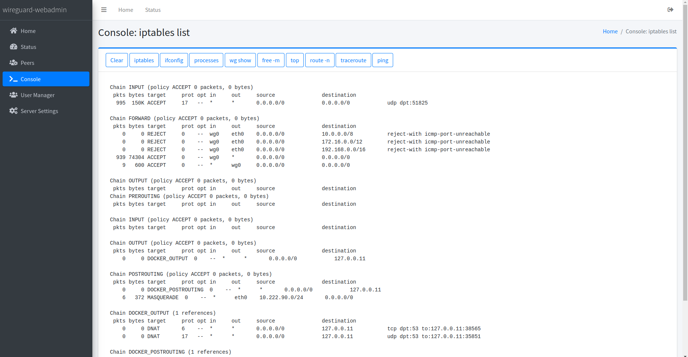

## 🌍 Read this in other languages:
- 🇬🇧 [English](README.md)
- 🇧🇷 [Português](docs/README.pt-br.md)
- 🇪🇸 [Español](docs/README.es.md)
- 🇫🇷 [Français](docs/README.fr.md)
- 🇩🇪 [Deutsch](docs/README.de.md)

✨ If you find any issues with the translation or would like to request a new language, please open an [issue](https://github.com/eduardogsilva/wireguard_webadmin/issues). 


# wireguard_webadmin

wireguard_webadmin is a full-featured yet easy-to-configure web interface for managing WireGuard VPN instances. Designed to simplify the administration of WireGuard networks, it provides a user-friendly interface that supports multiple users with varying access levels, multiple WireGuard instances with individual peer management, and support for crypto key routing for site-to-site interconnections.

## Features

- **Individual Peer Transfer History**: Track individual download and upload volumes for each peer.
- **Advanced Firewall Management**: Experience effortless and comprehensive VPN firewall management, designed for simplicity and effectiveness.
- **Port Forwarding**: Seamlessly redirect TCP or UDP ports to peers or networks located beyond those peers with ease!
- **DNS Server**: Custom hosts and DNS blacklist support for enhanced security, and improved privacy.
- **Multi-User Support**: Manage access with different permission levels for each user.
- **Multiple WireGuard Instances**: Enables separate management for peers across multiple instances.
- **Crypto Key Routing**: Simplifies the configuration for site-to-site interconnections.
- **Seamless VPN Invite Sharing**: Instantly generate and distribute secure, time-sensitive VPN invites via email or WhatsApp, complete with QR code and configuration file options.

 
This project aims to offer an intuitive and user-friendly solution for WireGuard VPN management without compromising the power and flexibility WireGuard provides.

## License

This project is licensed under the MIT License - see the [LICENSE](LICENSE) file for details.

## Screenshots

### Peer List
Displays a comprehensive list of peers, including their status and other details, allowing for easy monitoring and management of WireGuard VPN connections.


### Peer Details
Displays key peer information, detailed metrics, and a complete traffic volume history. Also includes a QR code for easy configuration.


### VPN Invite
Generates secure, time-sensitive VPN invites for easy configuration sharing via email or WhatsApp, complete with QR code and configuration file options.


### Enhanced DNS Filtering
Block unwanted content with built-in DNS filtering lists. Predefined categories such as porn, gambling, fakenews, adware, and malware are included, with the ability to add custom categories for a tailored security experience.


### Firewall Management
Offers a comprehensive interface for managing VPN firewall rules, enabling users to easily create, edit, and delete rules with iptables-style syntax. This feature ensures precise control over network traffic, enhancing security and connectivity for WireGuard VPN instances.


### WireGuard Instance Settings
A central hub for managing settings across one or multiple WireGuard instances, enabling straightforward configuration adjustments for VPN interfaces.
 
### Console 
Offers quick access to common debugging tools, facilitating the diagnosis and resolution of potential issues within the WireGuard VPN environment.
 
### User Manager
Supports multi-user environments by allowing the assignment of varying permission levels, from restricted access to full administrative rights, ensuring secure and tailored access control.


Based on your requirements, here's an updated set of deployment instructions incorporating the use of `wget` for fetching the latest `docker-compose.yml` files directly from your GitHub repository, and guidance on creating a `.env` file for environment variables. These instructions ensure users always have the most current version of your deployment configuration and clarify the setup process.

## Deployment Instructions

Follow these steps to deploy the WireGuard WebAdmin:

1.**Prepare the Environment:**
   
   First, create a directory for the WireGuard WebAdmin project and navigate into it. This will serve as the working directory for the deployment.

   ```bash
   mkdir wireguard_webadmin && cd wireguard_webadmin
   ```

2.**Fetch the Docker Compose File:**

   Depending on your deployment scenario, choose one of the following commands to download the appropriate `docker-compose.yml` file directly into your working directory. This approach ensures you're using the latest version of the deployment configuration.

   ### With NGINX (Recommended)
   
   For a production-ready deployment with NGINX as a reverse proxy (recommended for most users), use:

   ```bash
   wget -O docker-compose.yml https://raw.githubusercontent.com/eduardogsilva/wireguard_webadmin/main/docker-compose.yml
   ```
This mode is recommended for running the web admin interface. The container deployment will automatically generate a self-signed certificate for you. If you want to update your certificates, simply navigate to the `certificates` volume and replace `nginx.pem` and `nginx.key` with your own certificates.
   ### Without NGINX (Debug Mode and Testing Only)
   
   For a debug environment without NGINX, suitable only for testing (not recommended for production), use:

   ```bash
   wget -O docker-compose.yml https://raw.githubusercontent.com/eduardogsilva/wireguard_webadmin/main/docker-compose-no-nginx.yml
   ```

3.**Create the `.env` File:**

   Create a `.env` file in the same directory as your `docker-compose.yml` with the following content, adjusting `my_server_address` to your server's DNS name or IP address. This step is crucial for ensuring the application functions correctly.

   ```env
   # Configure SERVER_ADDRESS to match the address of the server. If you don't have a DNS name, you can use the IP address.
   # A missconfigured SERVER_ADDRESS will cause the app to have CSRF errors.
   SERVER_ADDRESS=my_server_address
   DEBUG_MODE=False
   
   # Choose a timezone from https://en.wikipedia.org/wiki/List_of_tz_database_time_zones
   TIMEZONE=America/Sao_Paulo
   
   # If you need additional hosts to be allowed, you can specify them here.
   # The SERVER_ADDRESS will always be allowed.
   #EXTRA_ALLOWED_HOSTS=app1.example.com,app2.example.com:8443,app3.example.com
   ```

   Replace `my_server_address` with your actual server address.

4.**Run Docker Compose:**

   Execute the Docker Compose command to start your deployment.

   ### With NGINX (Recommended)
   
   ```bash
   docker compose up -d
   ```
   
   Access the web interface using `https://yourserver.example.com`. If you are using a self-signed certificate, you must accept the certificate exception that your browser will present.

   ### Without NGINX (Debug Mode and Testing Only)
   
   If you opted for the non-NGINX setup, simply run the previously fetched `docker-compose-no-nginx.yml` with:

   ```bash
   docker compose -f docker-compose-no-nginx.yml up -d
   ```
   
   Access the web interface using `http://127.0.0.1:8000`.

After completing these steps, your WireGuard WebAdmin should be up and running. Begin the configuration by accessing your server's web interface.

Certainly, let's refine the upgrade instructions with the inclusion of a backup step for the database and a more appropriate suggestion for transitioning users from a git clone workflow. 


## Upgrade Instructions

Upgrading your WireGuard WebAdmin installation ensures you have access to the latest features, security improvements, and bug fixes. Follow these instructions for a smooth upgrade:

### Preparing for Upgrade:

1.**Transitioning from a Git Clone Workflow:**
  
Begin by navigating to your wireguard_webadmin directory:
   ```bash
   cd path/to/wireguard_webadmin
   ```
   If you're upgrading from an existing git clone installation, navigate to your current project directory. 
   ```bash
   cd /path/to/wireguard_webadmin_git_clone
   ```

2.**Shutdown Services:**

   Stop all running services to prevent data loss during the upgrade.
   ```bash
   docker compose down
   ```

3.**Pull latest images:**
   
   Update your local images
   ```bash
   docker compose pull
   ```


4.**Backup Your Data:**

   Before making any changes, back up your database and any other important data. This step is crucial for restoring your setup if needed.
   
   - **Backup Database Command:**
     ```bash
     tar cvfz wireguard-webadmin-backup-$(date +%Y-%m-%d-%H%M%S).tar.gz /var/lib/docker/volumes/wireguard_webadmin_wireguard/_data/
     ```
   
   Replace `/var/lib/docker/volumes/wireguard_webadmin_wireguard/_data/` with the actual path to your Docker volume data if it's different. This command saves the backup to the current directory.


5.**Deploy Using Docker Compose:**
   
   Follow the previously outlined [Deployment Instructions](#deployment-instructions).

Don't forget to update the `docker-compose.yml` file to the latest version by re-downloading it from the repository.


### Post-Upgrade Checks:

- **Verify Operation:** After the services start, access the web interface to ensure WireGuard WebAdmin functions as expected. Examine the application logs for potential issues.
- **Support and Troubleshooting:** For any complications or need for further information, consult the project's [Discussions](https://github.com/eduardogsilva/wireguard_webadmin/discussions) page or relevant documentation.

By adhering to these instructions, you will update your WireGuard WebAdmin to the latest version, incorporating all available enhancements and security updates. Remember, regular backups and following these upgrade steps will help maintain your deployment's health and security.


## Contributing

Contributions make the open-source community an amazing place to learn, inspire, and create. Your contributions are **greatly appreciated**.

## Support

If you encounter any issues or require assistance, please open an issue on the project's GitHub page.
