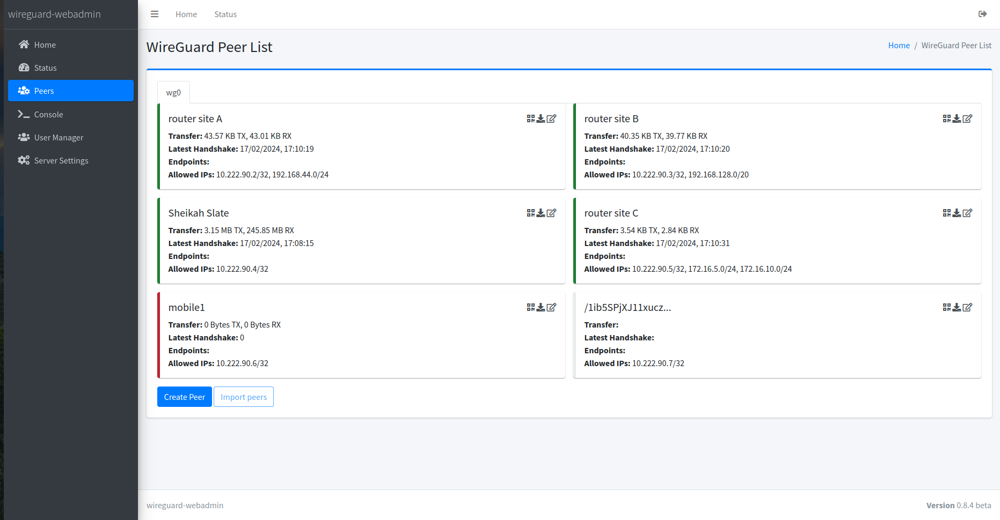
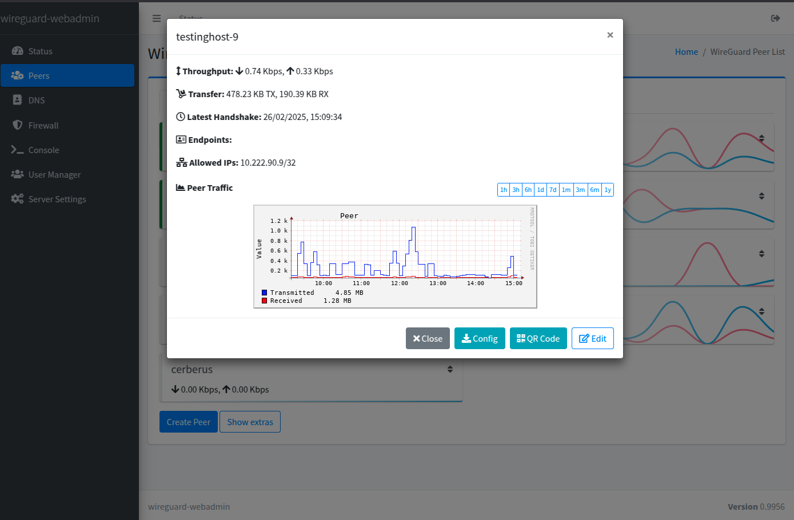
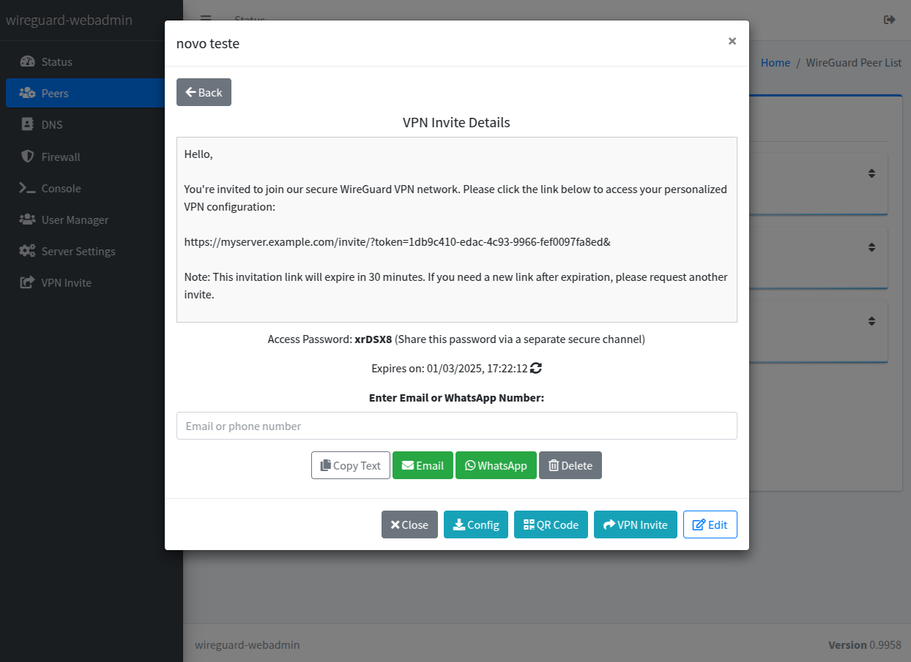
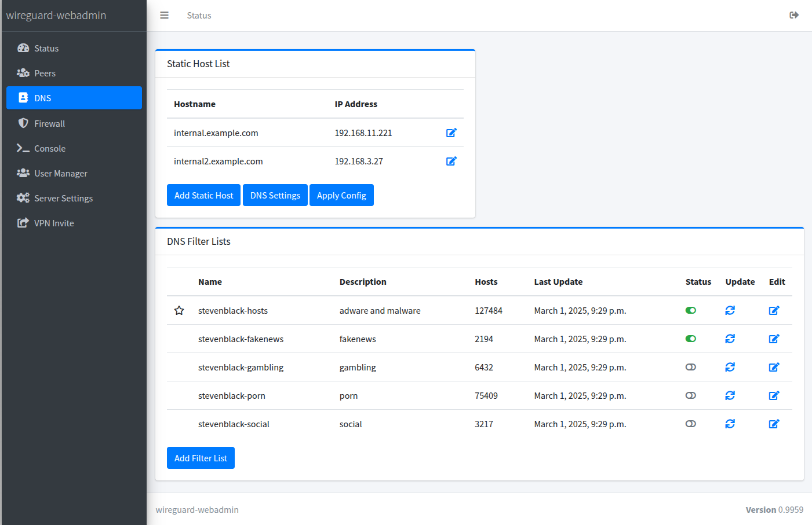
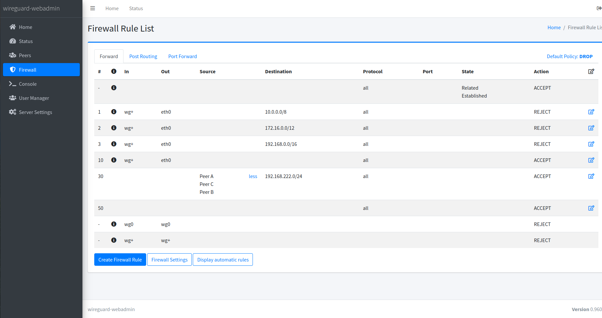
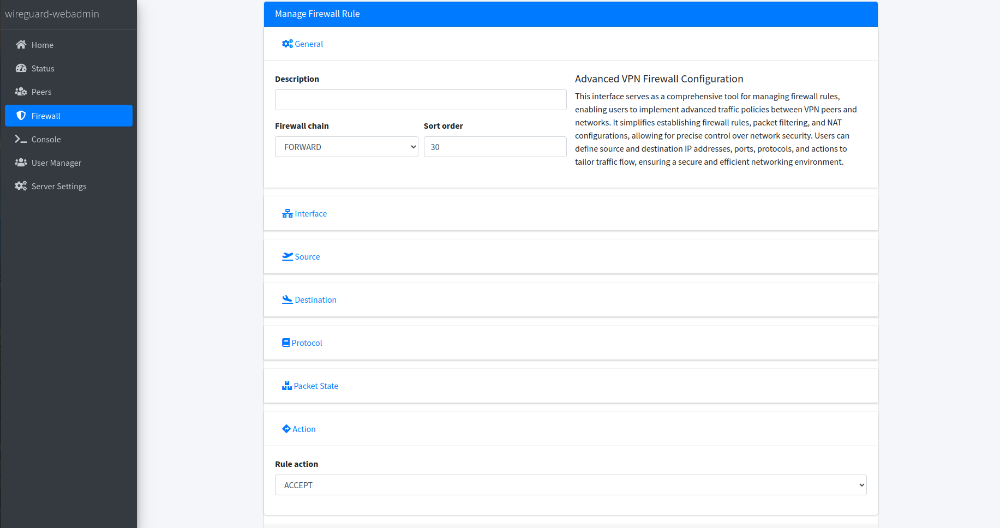
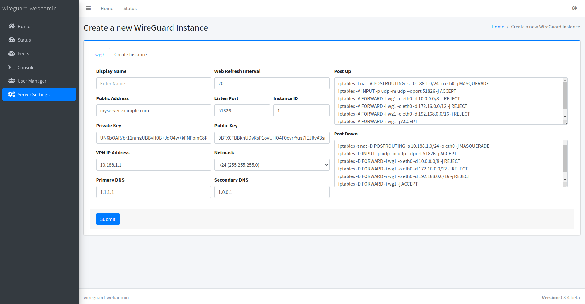
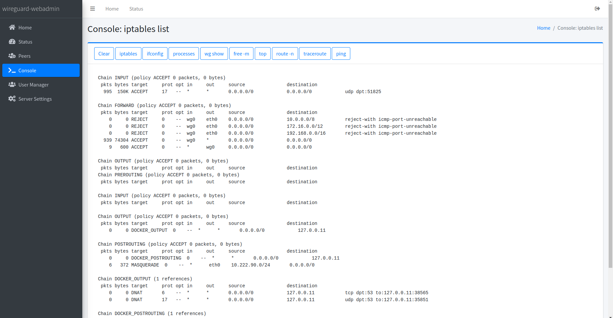
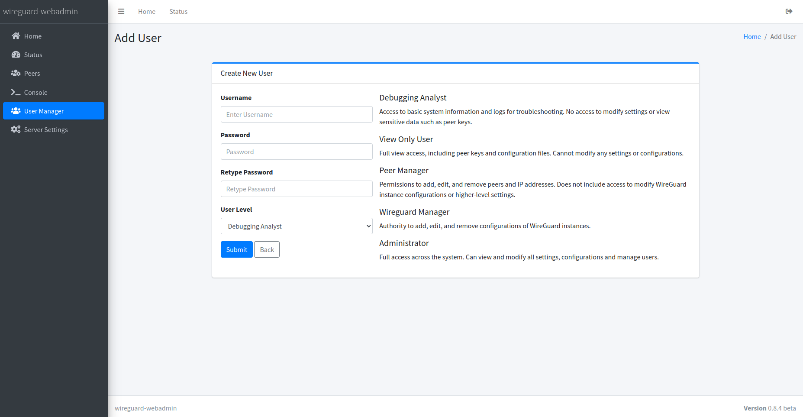

## 🌍 Lies das in anderen Sprachen:
- 🇬🇧 [English](../README.md)
- 🇧🇷 [Português](README.pt-br.md)
- 🇪🇸 [Español](README.es.md)
- 🇫🇷 [Français](README.fr.md)
- 🇩🇪 [Deutsch](README.de.md)

✨ Wenn dir bei der Übersetzung Fehler auffallen oder du eine neue Sprache anfordern möchtest, öffne bitte ein [Issue](https://github.com/eduardogsilva/wireguard_webadmin/issues).

# wireguard_webadmin

**wireguard_webadmin** ist eine funktionsreiche und dennoch einfach zu konfigurierende Weboberfläche zur Verwaltung von WireGuard‑VPN‑Instanzen. Das Tool wurde entwickelt, um die Administration von WireGuard‑Netzwerken zu vereinfachen und bietet eine benutzerfreundliche Oberfläche mit Unterstützung für:

- mehrere Benutzer mit unterschiedlichen Berechtigungsstufen,
- mehrere WireGuard‑Instanzen mit individueller Peer‑Verwaltung sowie
- Crypto‑Key‑Routing für Site‑to‑Site‑Verbindungen.

## Funktionen

- **Individuelle Transferhistorie pro Peer**: Verfolge Upload‑ und Download‑Volumen jedes einzelnen Peers.
- **Erweiterte Firewall‑Verwaltung**: Mühelose, umfassende Verwaltung der VPN‑Firewall – konzipiert für Einfachheit und Effektivität.
- **Portweiterleitung**: Leite TCP‑ oder UDP‑Ports bequem an Peers oder an Netzwerke hinter diesen Peers weiter.
- **DNS‑Server**: Benutzerdefinierte Hosts und DNS‑Blacklists für höhere Sicherheit und verbesserten Datenschutz.
- **Mehrbenutzer‑Unterstützung**: Verwalte den Zugriff mit unterschiedlichen Berechtigungsstufen für jeden Benutzer.
- **Mehrere WireGuard‑Instanzen**: Separate Verwaltung der Peers über mehrere Instanzen hinweg.
- **Crypto‑Key‑Routing**: Vereinfacht die Konfiguration von Site‑to‑Site‑Verbindungen.
- **Einfaches Teilen von VPN‑Einladungen**: Erzeuge und verteile sofort sichere, zeitlich begrenzte VPN‑Einladungen per E‑Mail oder WhatsApp – inklusive QR‑Code und Konfigurationsdatei.

Dieses Projekt zielt darauf ab, eine intuitive und benutzerfreundliche Lösung für das WireGuard‑Management bereitzustellen, ohne die Flexibilität und Leistung von WireGuard einzuschränken.

## Lizenz

Dieses Projekt steht unter der MIT‑Lizenz – siehe [LICENSE](../LICENSE) für Details.

## Screenshots

### Peer‑Liste
Zeigt eine vollständige Liste der Peers inklusive Status und weiterer Details zur einfachen Überwachung und Verwaltung von WireGuard‑Verbindungen.


### Peer‑Details
Zeigt wichtige Peer‑Informationen, detaillierte Metriken sowie eine vollständige Traffic‑Historie. Enthält außerdem einen QR‑Code für die einfache Konfiguration.


### VPN‑Einladung
Erstellt sichere, zeitlich begrenzte VPN‑Einladungen zum einfachen Teilen per E‑Mail oder WhatsApp – inklusive QR‑Code und Konfigurationsdatei.


### Erweiterte DNS‑Filterung
Blockiere unerwünschte Inhalte mit integrierten DNS‑Filterlisten. Vorgefertigte Kategorien wie Pornografie, Glücksspiel, Fake‑News, Adware und Malware sind enthalten; eigene Kategorien lassen sich hinzufügen, um die Sicherheit anzupassen.


### Firewall‑Verwaltung
Bietet eine umfassende Oberfläche zur Verwaltung von VPN‑Firewall‑Regeln. Regeln können mit iptables‑ähnlicher Syntax erstellt, bearbeitet und gelöscht werden und ermöglichen so eine präzise Steuerung des Datenverkehrs.



### WireGuard‑Instanz‑Einstellungen
Zentrale Anlaufstelle für die Verwaltung der Einstellungen einer oder mehrerer WireGuard‑Instanzen.


### Konsole
Schneller Zugriff auf häufig genutzte Debugging‑Tools zur Diagnose und Lösung potenzieller Probleme in der WireGuard‑Umgebung.


### Benutzerverwaltung
Unterstützt Mehrbenutzer‑Umgebungen durch Zuweisung unterschiedlicher Berechtigungsstufen – von eingeschränktem Zugriff bis hin zu vollständigen Administratorrechten.


Auf Basis deiner Anforderungen wurden die folgenden Deploy‑Anweisungen erstellt. Sie verwenden `wget`, um stets die aktuellste `docker-compose.yml` direkt aus deinem GitHub‑Repository abzurufen, und erläutern die Erstellung einer `.env`‑Datei für Umgebungsvariablen. So stellst du sicher, dass Nutzer immer mit der neuesten Deployment‑Konfiguration arbeiten.

## Deploy‑Anleitung

Folge diesen Schritten, um WireGuard WebAdmin bereitzustellen:

1. **Umgebung vorbereiten**

   Erstelle zunächst ein Verzeichnis für WireGuard WebAdmin und wechsle hinein:

   ```bash
   mkdir wireguard_webadmin && cd wireguard_webadmin
   ```

2.  **Docker‑Compose‑Datei herunterladen**

    Wähle je nach Szenario einen der folgenden Befehle, um die passende `docker-compose.yml` herunterzuladen. So nutzt du stets die aktuelle Version der Deployment‑Datei.

    ### Option 1: Mit NGINX (empfohlen)

    Für eine produktionsreife Bereitstellung mit NGINX als Reverse‑Proxy (empfohlen):

    ```bash
    wget -O docker-compose.yml https://raw.githubusercontent.com/eduardogsilva/wireguard_webadmin/main/docker-compose.yml
    ```

    Im Standard generiert der Container ein selbstsigniertes Zertifikat. Eigene Zertifikate können durch Ersetzen von `nginx.pem` und `nginx.key` im Volume `certificates` hinterlegt werden.

    ### Option 2: Ohne NGINX

    Wenn Sie Ihren eigenen Reverse-Proxy verwenden oder das System ohne einen solchen betreiben möchten, nutzen Sie:

    ```bash
    wget -O docker-compose.yml https://raw.githubusercontent.com/eduardogsilva/wireguard_webadmin/main/docker-compose-no-nginx.yml
    ```

> [!CAUTION]
> Es wird nicht empfohlen, das System ohne HTTPS (NGINX) zu betreiben, da dies Sicherheitsrisiken birgt. Wenn Sie diese Option wählen, stellen Sie sicher, dass Sie eine sichere Verbindung verwenden (z. B. über Ihren eigenen Reverse-Proxy mit SSL).

3.  **.env‑Datei erstellen**

    Erstelle eine `.env`‑Datei im selben Verzeichnis wie deine `docker-compose.yml` und passe `my_server_address` an die DNS‑Adresse oder IP deines Servers an:

    ```env
    # SERVER_ADDRESS muss auf den Server zeigen. Ohne DNS‑Namen kann die IP genutzt werden.
    # Ein falsch konfigurierter SERVER_ADDRESS führt zu CSRF‑Fehlern.
    SERVER_ADDRESS=my_server_address
    DEBUG_MODE=False

    # Wähle eine Zeitzone aus https://en.wikipedia.org/wiki/List_of_tz_database_time_zones
    TIMEZONE=Europe/Berlin

    # WireGuard‑Status‑Caching‑Einstellungen
    # Dies verbessert die Leistung, indem die Anzahl der Aufrufe des `wg`-Befehls reduziert und aktuelle Ergebnisse gespeichert werden.
    # WIREGUARD_STATUS_CACHE_ENABLED=True
    #
    # Wie viele zwischengespeicherte WireGuard-Status-Snapshots beim Laden der Seite vorgeladen werden sollen.
    # Dies ermöglicht es, dass Traffic-Diagramme bereits ausgefüllt angezeigt werden, anstatt leer zu beginnen.
    # Verringern Sie diesen Wert, wenn sich die initiale Peer-Liste langsam anfühlt.
    # 0 = Vorladen deaktivieren, 9 = Traffic-Diagramme vollständig ausfüllen.
    # WIREGUARD_STATUS_CACHE_WEB_LOAD_PREVIOUS_COUNT=9

    # Wenn Sie zusätzliche erlaubte Hosts benötigen, können Sie diese hier angeben.
    # Die SERVER_ADDRESS wird immer erlaubt sein.
    # Beispiel: EXTRA_ALLOWED_HOSTS=app1.beispiel.com,app2.beispiel.com:8443,app3.beispiel.com
    #EXTRA_ALLOWED_HOSTS=app1.beispiel.com,app2.beispiel.com:8443,app3.beispiel.com
    ```

4.  **Docker Compose ausführen**
 
    Führen Sie den Docker Compose-Befehl aus, um Ihr Deployment zu starten:

    ```bash
    docker compose up -d
    ```
 
    Web‑Interface unter `https://yourserver.example.com` öffnen. Bei selbstsigniertem Zertifikat muss die Ausnahme akzeptiert werden.

Nach diesen Schritten sollte WireGuard WebAdmin laufen. Konfiguriere anschließend deine Instanzen über das Web‑Interface.

## Upgrade‑Anleitung

Regelmäßige Upgrades stellen sicher, dass du die neuesten Funktionen, Sicherheitsverbesserungen und Bugfixes erhältst.

### Vorbereitung

 1. **In das Projektverzeichnis wechseln**
 
    ```bash
    cd wireguard_webadmin
    ```

2. **Dienste stoppen**

   ```bash
   docker compose down
   ```

3. **Aktuelle Images ziehen**

   ```bash
   docker compose pull
   ```

4. **Daten sichern**

   ```bash
   tar cvfz wireguard-webadmin-backup-$(date +%Y-%m-%d-%H%M%S).tar.gz /var/lib/docker/volumes/wireguard_webadmin_wireguard/_data/
   ```

   Passe den Pfad zum Volume ggf. an.

5. **Neu deployen**

   Folge anschließend der [Deploy‑Anleitung](#deploy-anleitung) und lade dabei die aktuelle `docker-compose.yml` erneut herunter.

### Nach dem Upgrade

- **Funktion prüfen**: Web‑Interface aufrufen und Logs prüfen.
- **Unterstützung**: Bei Problemen siehe [Discussions](https://github.com/eduardogsilva/wireguard_webadmin/discussions).

## Beitragen

Beiträge machen die Open‑Source‑Community großartig. **Danke für jede Unterstützung!**

## Support

Bei Fragen oder Problemen eröffne bitte ein Issue auf GitHub.
