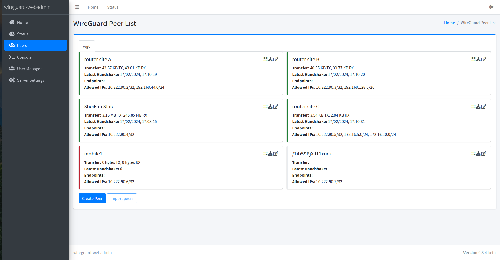
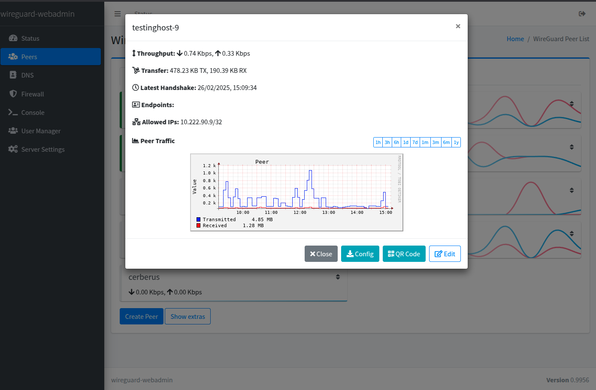
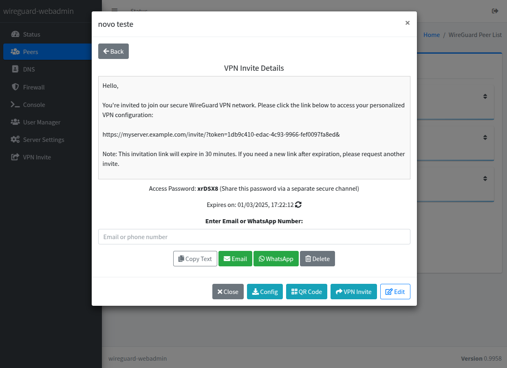
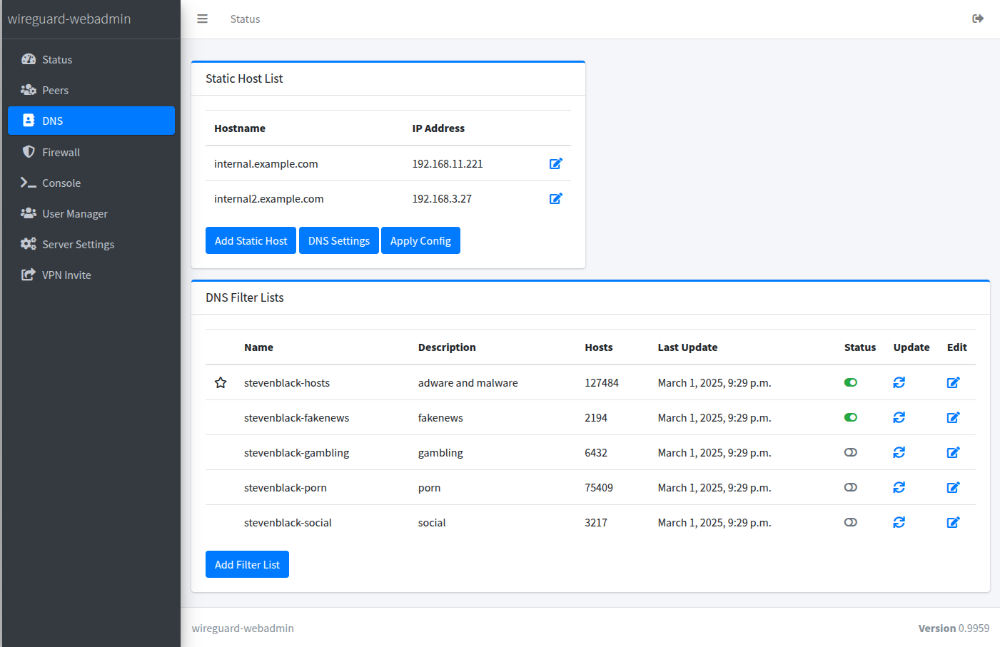
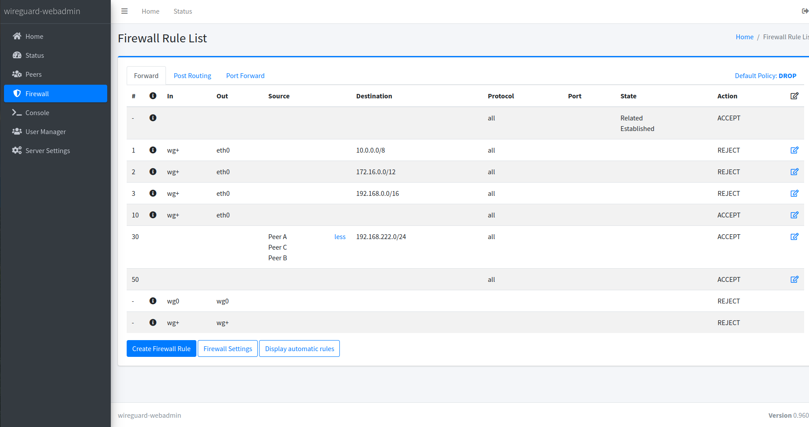
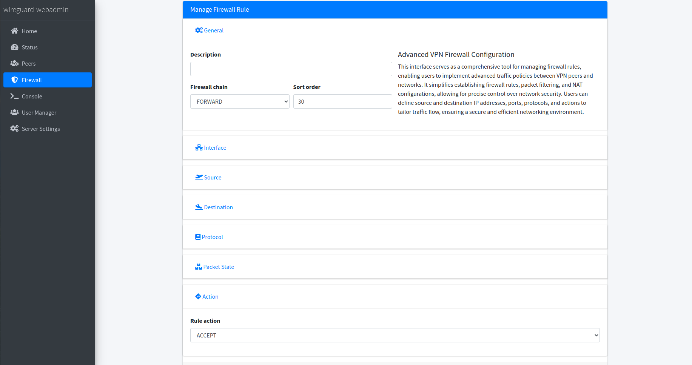
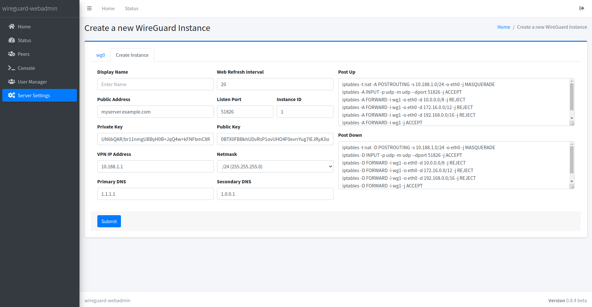
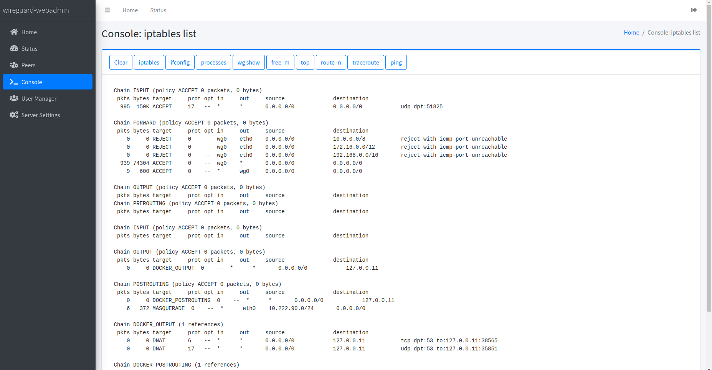
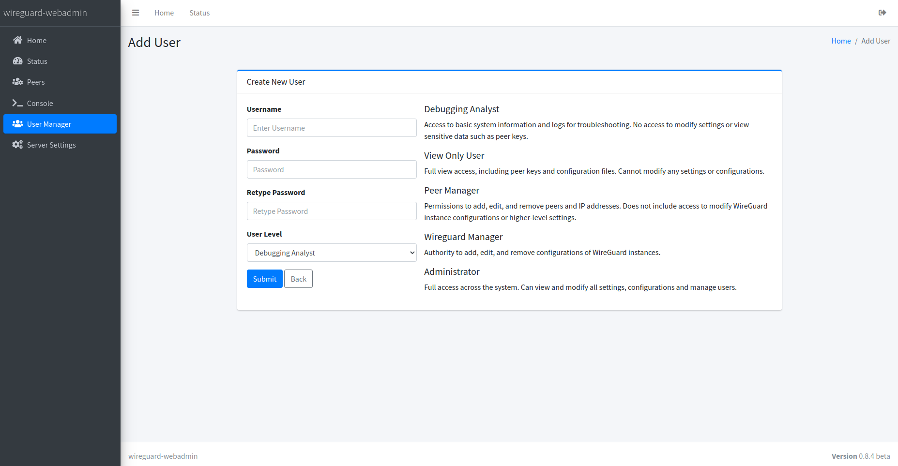

## 🌍 Lea esto en otros idiomas:
- 🇬🇧 [English](../README.md)
- 🇧🇷 [Português](README.pt-br.md)
- 🇪🇸 [Español](README.es.md)
- 🇫🇷 [Français](README.fr.md)
- 🇩🇪 [Deutsch](README.de.md)

✨ Si encuentra algún problema con la traducción o desea solicitar un nuevo idioma, por favor abra un [issue](https://github.com/eduardogsilva/wireguard_webadmin/issues).

# wireguard_webadmin

**wireguard_webadmin** es una interfaz web completa y fácil de configurar para administrar instancias de WireGuard VPN. Diseñada para simplificar la administración de redes WireGuard, ofrece una interfaz intuitiva que admite múltiples usuarios con distintos niveles de acceso, varias instancias de WireGuard con gestión individual de peers y soporte para *crypto‑key routing* en interconexiones *site‑to‑site*.

## Funcionalidades

- **Historial de Transferencia por Peer**: Controle los volúmenes de descarga y subida de cada peer individualmente.
- **Gestión Avanzada de Firewall**: Disfrute de una gestión de firewall de VPN integral y sencilla, diseñada para ser eficaz.
- **Redirección de Puertos**: Redirija puertos TCP o UDP a peers o redes detrás de esos peers con facilidad.
- **Servidor DNS**: Soporte para hosts personalizados y listas de bloqueo DNS para mayor seguridad y privacidad.
- **Soporte Multiusuario**: Gestione el acceso con diferentes niveles de permisos para cada usuario.
- **Múltiples Instancias de WireGuard**: Permite la gestión separada de peers en varias instancias.
- **Crypto‑Key Routing**: Simplifica la configuración de interconexiones *site‑to‑site*.
- **Compartir Invitaciones VPN Sin Esfuerzo**: Genere y distribuya al instante invitaciones VPN seguras y temporales por correo electrónico o WhatsApp, con código QR y archivo de configuración.
- **Plantillas de Enrutamiento por Peer**: Defina plantillas de enrutamiento reutilizables por instancia de WireGuard y aplíquelas a los pares, asegurando un comportamiento de enrutamiento consistente y predecible.
- **Cumplimiento de Rutas con Reglas de Firewall Automáticas**: Imponga políticas de enrutamiento generando automáticamente reglas de firewall que restrinjan los pares a las rutas explícitamente permitidas.

Este proyecto tiene como objetivo ofrecer una solución intuitiva y fácil de usar para la gestión de VPN WireGuard sin comprometer la potencia y flexibilidad que proporciona WireGuard.

## Licencia

Este proyecto está bajo la licencia MIT. Consulte el archivo [LICENSE](../LICENSE) para más detalles.

## Capturas de Pantalla

### Lista de Peers
Muestra una lista completa de peers, incluido su estado y otros detalles, lo que permite supervisar y gestionar fácilmente las conexiones VPN de WireGuard.


### Detalles del Peer
Presenta información clave del peer, métricas detalladas y un historial completo de volumen de tráfico. También incluye un código QR para una configuración sencilla.


### Invitación VPN
Genera invitaciones VPN seguras y temporales para compartir fácilmente la configuración por correo electrónico o WhatsApp, con código QR y archivo de configuración.


### Filtrado DNS Avanzado
Bloquee contenido no deseado mediante listas de filtrado DNS integradas. Incluye categorías predefinidas como pornografía, juegos de azar, noticias falsas, adware y malware, con la posibilidad de agregar categorías personalizadas para una experiencia de seguridad adaptada.


### Gestión de Firewall
Proporciona una interfaz completa para gestionar reglas de firewall de la VPN, permitiendo crear, editar y eliminar reglas con sintaxis estilo *iptables*. Esta característica garantiza un control preciso del tráfico de red, mejorando la seguridad y la conectividad de las instancias de WireGuard.



### Configuración de Instancias de WireGuard
Un centro de control para gestionar la configuración de una o varias instancias de WireGuard, permitiendo ajustes sencillos de la VPN.


### Consola
Acceso rápido a herramientas comunes de depuración, lo que facilita el diagnóstico y la resolución de posibles problemas en el entorno VPN WireGuard.


### Gestor de Usuarios
Admite entornos multiusuario permitiendo asignar distintos niveles de permisos, desde acceso restringido hasta derechos administrativos completos, garantizando un control de acceso seguro y personalizado.


---

## Instrucciones de Despliegue

Siga estos pasos para desplegar WireGuard WebAdmin:

1. **Prepare el Entorno:**

   Cree un directorio para el proyecto WireGuard WebAdmin y acceda a él. Este será el directorio de trabajo para el despliegue.

   ```bash
   mkdir wireguard_webadmin && cd wireguard_webadmin
   ```

2. **Obtenga el Archivo Docker Compose:**

   Según su escenario de despliegue, elija uno de los siguientes comandos para descargar el archivo compose correspondiente directamente en su directorio de trabajo. Este método garantiza que utilice la versión más reciente de la configuración.

   ### Opción 1: Con Caddy (Recomendado)
 
    Para el despliegue de producción recomendado con Caddy como *reverse proxy*, use:
 
    ```bash
    wget -O docker-compose.yml https://raw.githubusercontent.com/eduardogsilva/wireguard_webadmin/main/docker-compose-caddy.yml
    ```
 
    Esta es la forma recomendada de ejecutar la interfaz web de administración porque incluye todas las funciones compatibles del proxy inverso y proporciona gestión automática de certificados SSL mediante Caddy.
 
> [!IMPORTANT]
> Caddy requiere un nombre DNS válido, interno o público, apuntando a su servidor para poder obtener y renovar correctamente los certificados SSL.

    ### Opción 2: Sin Caddy
 
    Si prefiere usar su propio proxy inverso o ejecutar la aplicación sin Caddy, use:
 
    ```bash
    wget -O docker-compose.yml https://raw.githubusercontent.com/eduardogsilva/wireguard_webadmin/main/docker-compose-no-caddy.yml
    ```
 
> [!CAUTION]
> Ejecutar sin Caddy significa perder la experiencia integrada de publicación segura, incluidos los certificados SSL automáticos y la configuración recomendada de proxy inverso. Si elige esta opción, asegúrese de proporcionar su propia capa segura de exposición.

3. **Cree el Archivo `.env`:**

   Cree un archivo `.env` en el mismo directorio que su `docker-compose.yml` con el siguiente contenido, ajustando `my_server_address` al nombre DNS o IP de su servidor.

   ```env
   # Configure SERVER_ADDRESS para que coincida con la dirección de su servidor. Puede usar la IP si no tiene DNS.
   # Una SERVER_ADDRESS mal configurada provocará errores CSRF.
   SERVER_ADDRESS=my_server_address
   DEBUG_MODE=False

   # Elija una zona horaria de https://en.wikipedia.org/wiki/List_of_tz_database_time_zones
   TIMEZONE=America/Sao_Paulo

   # Configuración de caché de estado de WireGuard
   # Esto mejora el rendimiento al reducir el número de llamadas al comando `wg` y almacenar resultados recientes.
   # WIREGUARD_STATUS_CACHE_ENABLED=True
   #
   # Cuántas instantáneas del estado de WireGuard almacenadas en caché deben precargarse al cargar la página.
   # Esto permite que los gráficos de tráfico se muestren ya poblados en lugar de comenzar vacíos.
   # Reduzca este valor si la lista inicial de pares parece lenta.
   # 0 = desactivar precarga, 9 = completar totalmente los gráficos de tráfico.
   # WIREGUARD_STATUS_CACHE_WEB_LOAD_PREVIOUS_COUNT=9
   #
   # Con qué frecuencia (en segundos) se debe refrescar la caché.
   # Valores permitidos: 30, 60, 150, 300. Predeterminado: 60.
   # WIREGUARD_STATUS_CACHE_REFRESH_INTERVAL=60

   # Si necesita hosts adicionales permitidos, puede especificarlos aquí.
   # El SERVER_ADDRESS siempre estará permitido.
   # Ejemplo: EXTRA_ALLOWED_HOSTS=app1.ejemplo.com,app2.ejemplo.com:8443,app3.ejemplo.com
   #EXTRA_ALLOWED_HOSTS=app1.ejemplo.com,app2.ejemplo.com:8443,app3.ejemplo.com
   ```

   Sustituya `my_server_address` por la dirección real de su servidor.

4. **Ejecute Docker Compose:**
 
    Ejecute el comando Docker Compose para iniciar su despliegue.
 
    ```bash
    docker compose up -d
    ```
 
    Acceda a la interfaz web en `https://suserver.ejemplo.com`. Al usar el despliegue recomendado con Caddy, los certificados SSL se obtienen y renuevan automáticamente.

Tras completar estos pasos, WireGuard WebAdmin estará en funcionamiento. Comience la configuración accediendo a la interfaz web de su servidor.

---

## Instrucciones de Actualización

Actualizar su instalación de WireGuard WebAdmin garantiza acceso a nuevas funciones, mejoras de seguridad y correcciones. Siga estas instrucciones para una actualización sin problemas:

### Preparación para la Actualización:

1. **Vaya al Directorio del Proyecto:**
 
    Acceda al directorio `wireguard_webadmin`:
 
    ```bash
    cd wireguard_webadmin
    ```

2. **Detenga los Servicios:**

   Pare todos los servicios para evitar pérdida de datos durante la actualización.

   ```bash
   docker compose down
   ```

3. **Descargue las Imágenes Más Recientes:**

   Actualice sus imágenes locales:

   ```bash
   docker compose pull
   ```

4. **Haga Copia de Seguridad de Sus Datos:**

   Antes de cualquier cambio, realice una copia de seguridad de la base de datos y de datos importantes.

   ```bash
   tar cvfz wireguard-webadmin-backup-$(date +%Y-%m-%d-%H%M%S).tar.gz /var/lib/docker/volumes/wireguard_webadmin_wireguard/_data/
   ```

   Sustituya la ruta del volumen Docker si es diferente. El archivo se guardará en el directorio actual.

5. **Despliegue con Docker Compose:**

   Siga las [Instrucciones de Despliegue](#instrucciones-de-despliegue) indicadas anteriormente.

> **Nota:** No olvide actualizar `docker-compose.yml` a la versión más reciente descargándolo de nuevo del repositorio.

### Verificaciones Posteriores a la Actualización:

- **Verifique el Funcionamiento:** Una vez iniciados los servicios, acceda a la interfaz web para comprobar que WireGuard WebAdmin funciona correctamente. Revise los registros de la aplicación para detectar problemas.
- **Soporte y Solución de Problemas:** Si surge alguna complicación, consulte la sección de [Discussions](https://github.com/eduardogsilva/wireguard_webadmin/discussions) o la documentación relacionada.

Siguiendo estos pasos, actualizará WireGuard WebAdmin a la versión más reciente, incorporando todas las mejoras y correcciones de seguridad. Recuerde que realizar copias de seguridad periódicas y seguir estos pasos ayuda a mantener la salud y seguridad de su implementación.

---

## Contribuir

Las contribuciones hacen que la comunidad *open‑source* sea un lugar increíble para aprender, inspirar y crear. Sus contribuciones son **muy apreciadas**.

## Soporte

Si encuentra problemas o necesita ayuda, abra un *issue* en la página de GitHub del proyecto.
