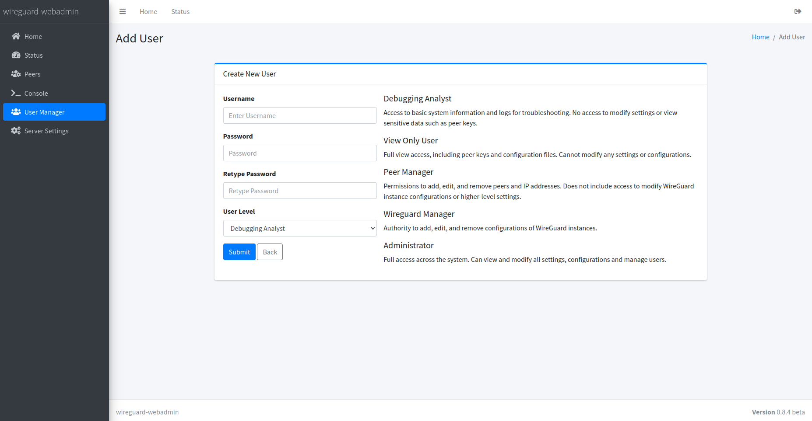

## 🌍 Lire ceci dans d’autres langues:
- 🇬🇧 [English](../README.md)
- 🇧🇷 [Português](README.pt-br.md)
- 🇪🇸 [Español](README.es.md)
- 🇫🇷 [Français](README.fr.md)
- 🇩🇪 [Deutsch](README.de.md)

✨ Si vous constatez un problème dans la traduction ou souhaitez demander une nouvelle langue, veuillez ouvrir une [issue](https://github.com/eduardogsilva/wireguard_webadmin/issues).

# wireguard_webadmin

wireguard_webadmin est une interface web complète et facile à configurer pour gérer des instances WireGuard VPN. Conçue pour simplifier l’administration des réseaux WireGuard, elle fournit une interface conviviale prenant en charge plusieurs utilisateurs avec différents niveaux d’accès, plusieurs instances WireGuard avec gestion individuelle des pairs, ainsi que le crypto‑key‑routing pour les interconnexions site‑à‑site.

## Fonctionnalités

- **Historique de transfert par pair**: suivez les volumes de téléchargement et d’envoi pour chaque pair.
- **Gestion avancée du pare‑feu**: administration VPN simple et efficace des règles de pare‑feu.
- **Redirection de ports**: redirigez facilement des ports TCP ou UDP vers des pairs ou des réseaux situés derrière ces pairs.
- **Serveur DNS**: prise en charge d’hôtes personnalisés et de listes de blocage pour une sécurité renforcée et une meilleure confidentialité.
- **Prise en charge multi‑utilisateur**: gérez l’accès avec différents niveaux d’autorisation.
- **Instances WireGuard multiples**: gérez séparément les pairs de plusieurs instances.
- **Crypto Key Routing**: simplifie la configuration des interconnexions site‑à‑site.
- **Partage d’invitations VPN**: générez et distribuez instantanément des invitations VPN sécurisées et limitées dans le temps par e‑mail ou WhatsApp, avec QR code et fichier de configuration.

Ce projet vise à offrir une solution intuitive et conviviale pour l’administration de WireGuard, sans compromettre la puissance et la flexibilité du protocole.

## Licence

Ce projet est distribué sous licence MIT – consultez le fichier [LICENSE](../LICENSE) pour plus de détails.

## Captures d’écran

### Liste des pairs
Affiche une liste complète des pairs, y compris leur état et d’autres détails, pour un suivi et une gestion aisés des connexions WireGuard.


### Détails d’un pair
Affiche les informations clés du pair, des métriques détaillées et un historique complet du volume de trafic. Comprend également un QR code pour une configuration facile.


### Invitation VPN
Génère des invitations VPN sécurisées et limitées dans le temps pour un partage facile de la configuration via e‑mail ou WhatsApp, avec QR code et fichier de configuration.


### Filtrage DNS avancé
Bloquez les contenus indésirables grâce aux listes de filtrage DNS intégrées. Des catégories prédéfinies comme pornographie, jeux d’argent, fake news, adware et malware sont incluses, avec la possibilité d’ajouter des catégories personnalisées pour une sécurité adaptée.


### Gestion du pare‑feu
Interface complète pour créer, modifier et supprimer des règles de pare‑feu avec une syntaxe de type iptables. Permet un contrôle précis du trafic réseau, améliorant la sécurité et la connectivité des instances WireGuard.


### Paramètres de l’instance WireGuard
Un hub centralisé pour gérer les paramètres d’une ou plusieurs instances WireGuard, permettant des ajustements de configuration simples.


### Console
Accès rapide aux outils de débogage courants afin de diagnostiquer et résoudre les problèmes potentiels dans l’environnement WireGuard.


### Gestion des utilisateurs
Prend en charge les environnements multi‑utilisateur en permettant d’assigner différents niveaux d’autorisation, du simple accès restreint aux droits administrateur complets.


## Instructions de déploiement

Suivez ces étapes pour déployer WireGuard WebAdmin:

1. **Préparer l’environnement**

   Créez d’abord un répertoire pour le projet et placez‑vous dedans:

   ```bash
   mkdir wireguard_webadmin && cd wireguard_webadmin
   ```

2. **Télécharger le fichier Docker Compose**

   Choisissez l’une des commandes suivantes pour récupérer la dernière version du `docker-compose.yml` directement depuis le dépôt GitHub.

   ### Avec NGINX (recommandé)

   ```bash
   wget -O docker-compose.yml https://raw.githubusercontent.com/eduardogsilva/wireguard_webadmin/main/docker-compose.yml
   ```

   Ce mode est recommandé pour exécuter l’interface web. Le déploiement générera automatiquement un certificat auto‑signé. Pour utiliser vos propres certificats, remplacez `nginx.pem` et `nginx.key` dans le volume `certificates`.

   ### Sans NGINX (mode debug/test uniquement)

   ```bash
   wget -O docker-compose.yml https://raw.githubusercontent.com/eduardogsilva/wireguard_webadmin/main/docker-compose-no-nginx.yml
   ```

3. **Créer le fichier `.env`**

   Dans le même répertoire que `docker-compose.yml`, créez un fichier `.env`:

   ```env
   # Configurez SERVER_ADDRESS avec le nom DNS ou l’adresse IP du serveur.
   # Une mauvaise valeur provoquera des erreurs CSRF.
   SERVER_ADDRESS=my_server_address
   DEBUG_MODE=False
   ```

   Remplacez `my_server_address` par l’adresse réelle de votre serveur.

4. **Lancer Docker Compose**

   #### Avec NGINX (recommandé)

   ```bash
   docker compose up -d
   ```

   Accédez à l’interface via `https://votreserveur.exemple.com`. Avec un certificat auto‑signé, votre navigateur demandera une exception.

   #### Sans NGINX (mode debug/test)

   ```bash
   docker compose -f docker-compose-no-nginx.yml up -d
   ```

   Accédez à l’interface via `http://127.0.0.1:8000`.

Après ces étapes, WireGuard WebAdmin sera opérationnel.

## Instructions de mise à jour

Pour profiter des dernières fonctionnalités et correctifs:

1. **Si vous utilisiez un clone Git**

   ```bash
   cd /chemin/vers/wireguard_webadmin_git_clone
   ```

2. **Arrêter les services**

   ```bash
   docker compose down
   ```

3. **Mettre à jour les images**

   ```bash
   docker compose pull
   ```

4. **Sauvegarder vos données**

   ```bash
   tar cvfz wireguard-webadmin-backup-$(date +%Y-%m-%d-%H%M%S).tar.gz /var/lib/docker/volumes/wireguard_webadmin_wireguard/_data/
   ```

   Adaptez le chemin si nécessaire.

5. **Déployer à nouveau**

   Suivez les [instructions de déploiement](#instructions-de-déploiement) et récupérez la dernière version de `docker-compose.yml`.

### Vérifications post‑mise à jour

- Vérifiez l’interface web et les journaux pour détecter d’éventuels problèmes.
- Besoin d’aide ? Consultez la section [Discussions](https://github.com/eduardogsilva/wireguard_webadmin/discussions).

## Contribuer

Les contributions sont **grandement appréciées**! Rejoignez‑nous pour améliorer ce projet open‑source.

## Support

En cas de problème, ouvrez une *issue* sur la page GitHub du projet.

