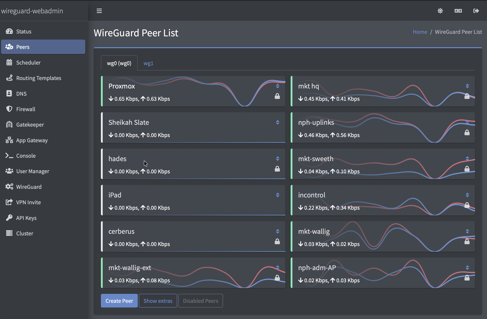
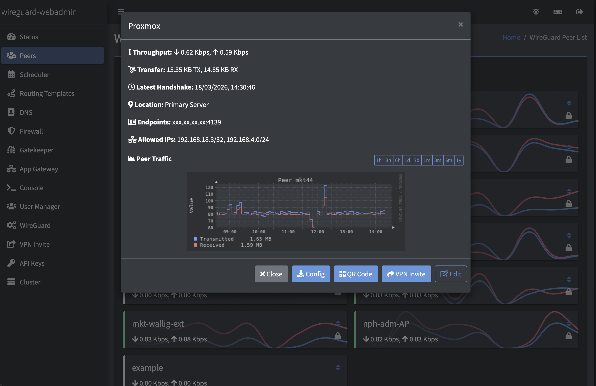
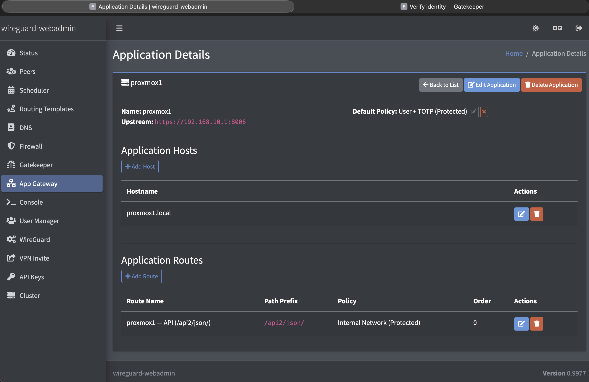
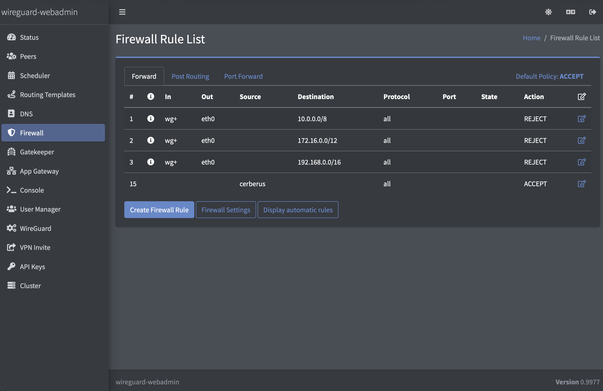
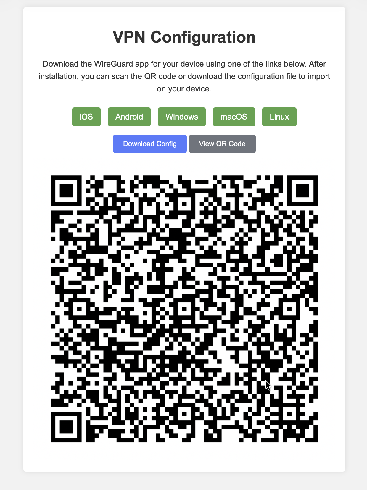

## 🌍 Leia em outros idiomas:
- 🇬🇧 [English](../README.md)
- 🇧🇷 [Português](README.pt-br.md)
- 🇪🇸 [Español](README.es.md)
- 🇫🇷 [Français](README.fr.md)
- 🇩🇪 [Deutsch](README.de.md)

✨ Se encontrar algum problema na tradução ou quiser solicitar um novo idioma, por favor abra uma [issue](https://github.com/eduardogsilva/wireguard_webadmin/issues).


# wireguard_webadmin

**Gerenciamento de VPN self-hosted e controle de acesso Zero Trust — tudo na sua infraestrutura.**

Mais do que um painel WireGuard: gerencie peers, regras de firewall, DNS, redirecionamento de portas e publique aplicações internas com autenticação — sem depender de serviços de terceiros. Roda em qualquer máquina Linux com Docker. Gratuito, open source, nada sai do seu servidor.

- ⚙️ **Gerenciar** — Múltiplas instâncias WireGuard, gráficos de tráfego por peer, firewall, listas de bloqueio DNS, convites VPN com QR code
- 🔒 **Proteger** — Gateway de aplicações Zero Trust com TOTP, ACL por IP e anti-força-bruta (Altcha PoW)
- ⚡ **Automatizar** — Acesso agendado por peer, templates de roteamento, links de convite com expiração, API REST v2

### 📖 [Documentação completa, guia de instalação e dicas em wireguard-webadmin.com](https://wireguard-webadmin.com/)

---

## Instalação Rápida

```bash
mkdir wireguard_webadmin && cd wireguard_webadmin
wget -O docker-compose.yml https://raw.githubusercontent.com/eduardogsilva/wireguard_webadmin/main/docker-compose-caddy.yml
# edite o .env com seu SERVER_ADDRESS
docker compose up -d
```

> Para instruções detalhadas, guia de upgrade e dicas de configuração acesse **[wireguard-webadmin.com](https://wireguard-webadmin.com/)**.

---

## Capturas de Tela

### Lista de Peers
Status em tempo real e gráficos de banda ao vivo para cada peer em todas as instâncias WireGuard.


### Detalhes do Peer
Histórico de tráfego, último handshake, IPs permitidos e QR code — tudo em um só lugar.


### Gateway de Aplicações Zero Trust
Publique apps internas como Proxmox ou Grafana com autenticação TOTP na frente — sem abrir portas.


### Gerenciamento de Firewall
Regras iptables por instância, redirecionamento de portas e ACLs de saída gerenciados pela interface.


### Convite VPN
Gere um convite compartilhável com QR code e arquivo de configuração. O usuário escaneia ou importa direto no cliente WireGuard.


---

## Licença

Este projeto é licenciado sob a licença MIT – consulte o arquivo [LICENSE](../LICENSE) para detalhes.

## Contribuindo

Contribuições são bem-vindas e muito apreciadas. Sinta-se à vontade para abrir issues ou pull requests no [GitHub](https://github.com/eduardogsilva/wireguard_webadmin).
